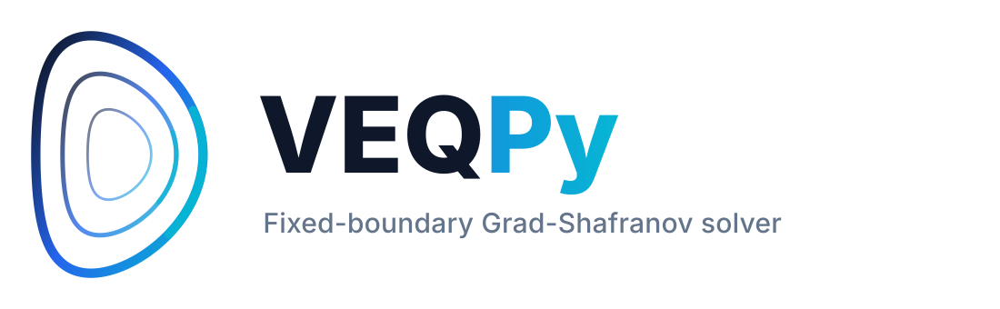

<p align="right">
  <a href="README.md">English</a> |
  <a href="docs/README_CN.md">中文</a>
</p>

<p>
  
</p>

<br clear="left"><br>

[](https://arxiv.org/abs/2606.11821)
[](https://www.python.org/)
[](https://pypi.org/project/veqpy/)
[](LICENSE)
[](tests/)
[](https://docs.astral.sh/ruff/)

---

# VEQPy

**VEQPy** is the Python implementation of **VEQ** (Veloce EQuilibrium), a fast
parametric Grad--Shafranov solver for fixed-boundary, axisymmetric tokamak equilibria.
It is designed for repeated modeling calls that require low-latency access to
continuous fixed-boundary geometry. Unlike grid-map equilibrium solvers whose primary
unknowns are two-dimensional flux values, VEQPy solves for MXH-type flux-surface
harmonics together with shifted-Chebyshev radial profile/source coefficients. The
primary nonlinear system is the finite-dimensional projection of the Grad--Shafranov
residual onto this representation; its solution is a continuous equilibrium snapshot
that can be resampled, serialized, and diagnosed. Sampled local strong-form residuals
and optional collocation polish are used as diagnostics or post-processing on the same
representation; they do not redefine the primary solve.

VEQPy is suited to parameter scans, source preprocessing, control-oriented iteration,
transport coupling, and surrogate-model workflows. It retains richer two-dimensional
shaping and residual diagnostics than low-order shape models, while remaining lighter
and easier to reuse than full solver-native equilibrium or reconstruction pipelines.

## Feature Overview

- **Compact equilibrium representation**: fixed-boundary flux surfaces, shaping profiles,
  and source-related radial profiles are represented by coefficients, with a continuous
  `Equilibrium` snapshot produced after the solve.
- **Unified source route layer**: PF, PP, PI, PJ1, PJ2, and PQ routes map pressure-gradient,
  toroidal-field, flux-gradient, current-related, or safety-factor information to one
  finite-dimensional residual assembly.
- **Explicit runtime boundary**: `Grid + OperatorCase -> Operator -> Solver -> Equilibrium`
  separates packed coefficients, runtime workspaces, nonlinear solve orchestration, and
  post-solve snapshots.
- **GEQDSK workflow support**: GEQDSK I/O, fixed-boundary fitting from GEQDSK boundaries,
  snapshot export, flux-surface comparison, and common diagnostics.
- **Formula-oriented model objects**: `Grid`, `Profile`, and `Equilibrium` use reactive
  derived properties to store minimal root state and lazily reconstruct geometry and
  physics diagnostics by formula.

## Installation

VEQPy requires Python 3.12 or newer. For normal use, install the published package from
PyPI into a project-local virtual environment:

```bash
python3.12 -m venv .venv
.venv/bin/python -m pip install --upgrade pip
.venv/bin/python -m pip install veqpy
```

For development, install VEQPy from a source checkout in editable mode. The `dev` extra
installs the runtime dependencies together with `pytest`, `ruff`, `build`, `twine`, and
other development helpers into the same environment.

```bash
git clone https://github.com/zhangtakeda/veqpy.git
cd veqpy
python3.12 -m venv .venv
.venv/bin/python -m pip install --upgrade pip
.venv/bin/python -m pip install -e ".[dev]"
```

For a runtime-only install from a local source checkout, omit the `dev` extra:

```bash
.venv/bin/python -m pip install .
```

All commands below use `.venv` explicitly; activating the environment is optional.

## Example Workflows

Basic demo:

```bash
.venv/bin/python examples/minimal_equilibrium.py
```

This script builds a smooth fixed-boundary case, solves an equilibrium using PF(`psin`)
source input, writes an `Equilibrium` JSON snapshot, and generates a flux-surface figure.
By default, outputs go under `./outputs/minimal_equilibrium`; set
`VEQPY_OUTPUT_DIR` to choose another directory.

GEQDSK demo:

```bash
.venv/bin/python examples/geqdsk_workflow.py
```

This script reads an EFIT-style GEQDSK file, fits it as a VEQPy fixed boundary, solves
PF(`psin`) and PQ(`psin`) cases with an `Ip` constraint using one-dimensional source
profiles from the GEQDSK file, and writes a two-column VEQPy-vs-GEQDSK comparison
figure. By default, it reads `./data/EFIT.geqdsk` and writes outputs under
`./outputs/geqdsk_workflow`; set `VEQPY_GEQDSK` and `VEQPY_OUTPUT_DIR` to override
those paths. **Reproducible scripts for manuscript figures will be released in the
corresponding tagged artifact package for the first public arXiv version.**

## Development Checks

```bash
.venv/bin/python -m compileall -q veqpy tests examples
.venv/bin/ruff check veqpy tests examples
.venv/bin/python -m pytest
```

## Implementation Documentation

Design patterns and model layer:

- [[reactive.md]](docs/details/reactive.md): minimal root state, formula-derived properties,
  lazy dependency validation, and snapshot consistency.
- [[registry.md]](docs/details/registry.md): registry-backed method families, source-route
  coordinate structure, and dispatch boundaries.
- [[serial.md]](docs/details/serial.md): root-state serialization, JSON/pickle handlers,
  and persistence boundaries.
- [[model.md]](docs/details/model.md): responsibilities, snapshot boundaries, and diagnostic
  interfaces for `Grid`, `Profile`, `Boundary`, `Geqdsk`, and `Equilibrium`.

Hot-path operator and solver:

- [[operator.md]](docs/details/operator.md): packed layout, build plan, stage pipeline,
  and runtime/snapshot separation.
- [[solver.md]](docs/details/solver.md): nonlinear solve lifecycle, fallback behavior,
  residual normalization, and collocation polish.

Numerical construction:

- [[interpolation.md]](docs/details/interpolation.md): one-dimensional source-data remapping.
- [[quadrature.md]](docs/details/quadrature.md): semantics of radial quadrature schemes.
- [[calculus.md]](docs/details/calculus.md): scheme boundaries for radial differentiation and
  integration matrices.

## Paper and Reproducibility Resources

VEQPy is associated with the companion manuscript **"VEQ: a fast parametric
Grad--Shafranov solver for fixed-boundary tokamak equilibria with flexible source
inputs"**. The article-specific reproduction package will be released as a tagged
artifact accompanying the first public arXiv version. It will include figure scripts,
benchmark scripts, GEQDSK inputs or generation scripts, rendered figures, and dependency
metadata.

Related VEQ-family and representation papers include:

- Ruohan Zhang, Huasheng Xie, Yueyan Li, Weiqi Meng, Feng Wang, and Zhengxiong Wang,
  "VEQ: a fast parametric Grad-Shafranov solver for fixed-boundary tokamak equilibria
  with flexible source profiles", arXiv:2606.11821, 2026.
  <https://arxiv.org/abs/2606.11821>
- Huasheng Xie and Yueyan Li, "What Is the Minimum Number of Parameters Required to
  Represent Solutions of the Grad-Shafranov Equation?", arXiv:2601.02942, 2026.
  <https://arxiv.org/abs/2601.02942>
- Xingyu Li, Huasheng Xie, Lai Wei, and Zhengxiong Wang, "Investigation of Toroidal
  Rotation Effects on Spherical Torus Equilibria using the Fast Spectral Solver VEQ-R", arXiv:2602.11422, 2026. <https://arxiv.org/abs/2602.11422>

---

<p>


<strong>License</strong>:<br>
<em>BSD 3-Clause License</em><br>

<strong>Maintainer</strong> (rhzhang):<br>
<em>Homepage</em> - <em>https://zhangtakeda.github.io</em><br>
<em>Email</em> - <em>rhzhang@mail.dlut.edu.cn</em><br>
&nbsp;&nbsp;&nbsp;&nbsp;&nbsp;&nbsp;&nbsp;&nbsp;&nbsp;&nbsp;&nbsp;&nbsp;<em>zhangtakeda@gmail.com</em><br>

</p>
